# VoiceBud

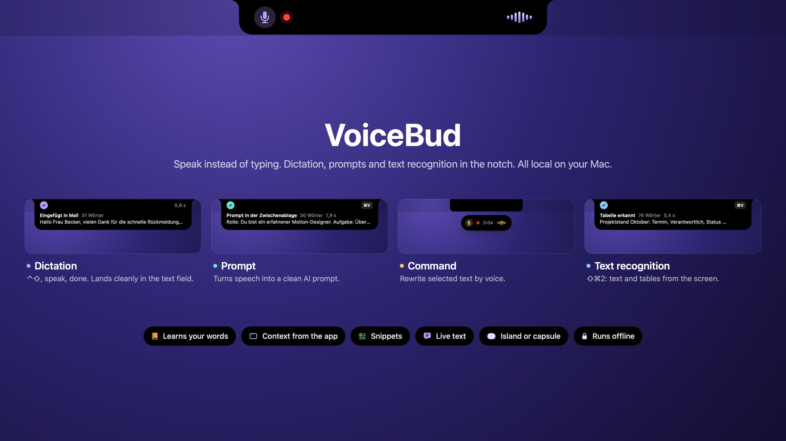

Fully offline voice dictation for macOS (Apple Silicon) — a free, local alternative to Wispr Flow.

Press `ctrl+shift` in any app → speak → press again → clean text appears at your cursor. Speech-to-text runs on-device (Whisper large-v3-turbo via MLX), and the structuring (fillers, self-corrections, lists, paragraphs, punctuation) runs through a local LLM (Qwen3.5-4B via MLX). No cloud, no subscription, no audio leaving your Mac.

- **Want to run it?** Follow [reproduce.md](reproduce.md) — setup in ~10 minutes.
- **Want to build it yourself with AI?** [steps.md](steps.md) has the exact Claude Code prompts that created this app.

Built with Claude Code (planned with Opus 4.8, built with Fable 5).

**Requirements:** A Mac with Apple Silicon (M1 or newer) and macOS 26.2 or later; the bundled MLX needs that version. 16 GB of memory is recommended.

**Permissions:** Microphone, Input Monitoring (the hotkeys) and Accessibility (pasting, screen context), asked step by step in the setup window. Screen Recording for the text recognition and, optionally, Automation for Microsoft Word (font of formulas) are asked the first time you use them. Everything runs on your Mac.

The interface is in English or German: it follows your Mac's language until you pick one. Dictation works in German and English, and in a mix of both.

## A tour

All screenshots below are rendered from the app itself.

### Language

Right after the welcome, setup asks for two languages: the app's own (English or German, preset from your Mac) and the language you dictate in. Automatic detects German or English for each take. If you only dictate in one language, choose it: that skips the detection, up to two seconds per dictation on older Macs (M1 to M4). Both can be changed later in the hub under General.

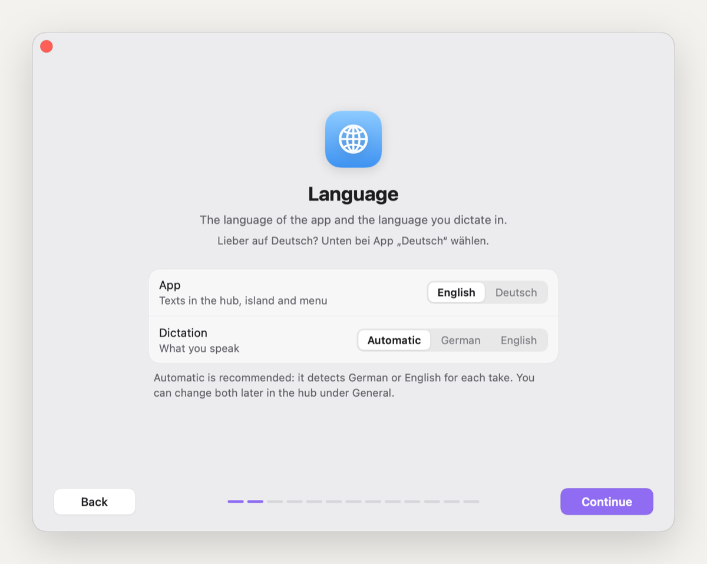

### Dictation: `ctrl+shift`

Press, speak, press again. The island grows out of the notch while VoiceBud listens, with a waveform that follows your voice.

After the text is pasted, the island confirms where it went, how many words and how long it took.

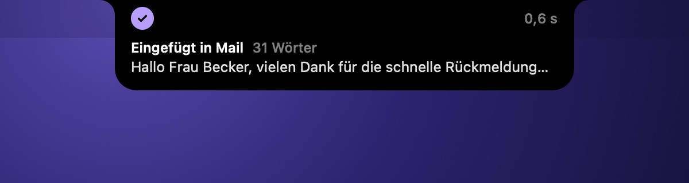

Rest the pointer on the confirmation and it unfolds with the whole text and a copy button.

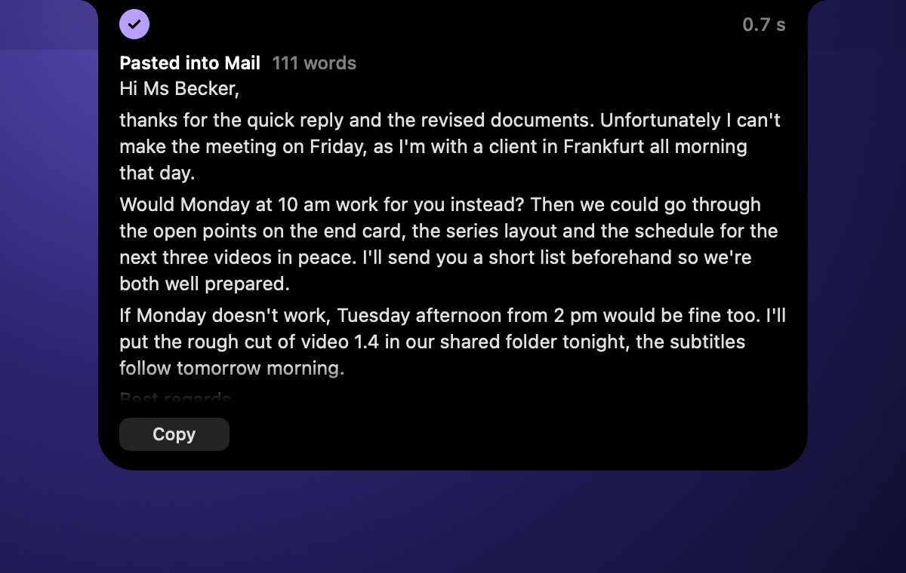

### Live text (optional)

Switch it on to watch the transcript while you speak. Self-corrections are cleaned up in the final text: "on Thursday, no, I mean Friday" becomes "on Friday".

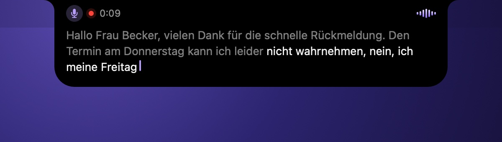

### Prompt: `ctrl+alt`

Speak loosely and get a structured prompt for an AI (role, task, context), pasted at your cursor or put on the clipboard.

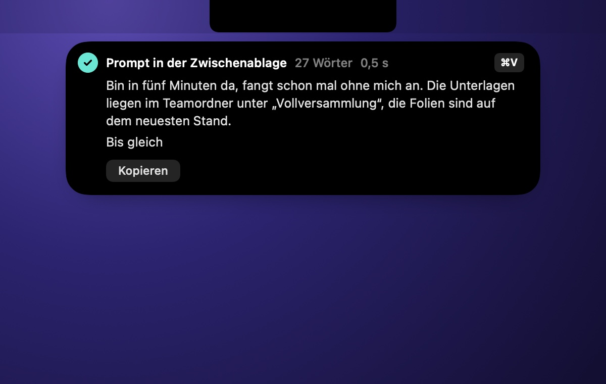

### Command: hold `ctrl+cmd` over selected text

Select text, hold the keys, say what to change ("more formal", "translate to English", "make it a list") and let go. The selection is rewritten in place.

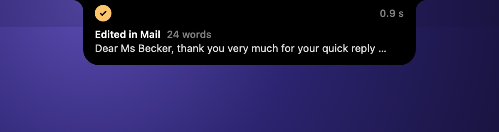

### Text recognition: `shift+cmd+2`

Drag over any part of the screen and the text lands on the clipboard, a replacement for TextShot.
- **Structure stays:** Paragraphs, lists and tables keep their structure. Tables paste as real tables into Notes, Mail, Numbers or Excel, and as Markdown into chat apps like Claude or ChatGPT.
- **Terminals and code editors:** Every line stays a line, indentation included.
- **Icons:** They are not read as stray characters.
- **Cut lines:** A line that the edge of your selection cuts through is left out instead of being read as garbage.

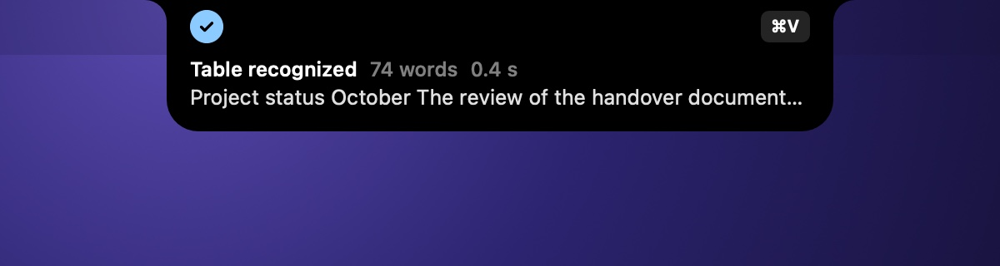

#### Formulas: tap `option` while choosing

Press `shift+cmd+2`, tap `option`, then drag. The island switches to "Select formula" and the region is read by the vision part of the same local model that cleans up your dictation: fractions, powers, roots, sums, integrals and Greek letters, together with the text around them. Tap `option` again to switch back; the island always shows which of the two the region will be read as.

What lands on the clipboard depends on where you paste:
- **Claude, ChatGPT, browsers, Notion, Obsidian, code editors:** Markdown with LaTeX (`$\sigma^2$`, `$$z_a = \frac{a - \mu}{\sigma}$$`), which they show as formulas or keep as source.
- **Word:** real, editable equations, with the text around them in the font at your cursor (macOS asks once whether VoiceBud may control Word; it only reads the font's name and size).
- **Notes, Mail and everything else:** readable characters, for example σ², √(x + 1), (a − μ)/σ.

You can change this for each app, and add apps, in the hub under Text Recognition:

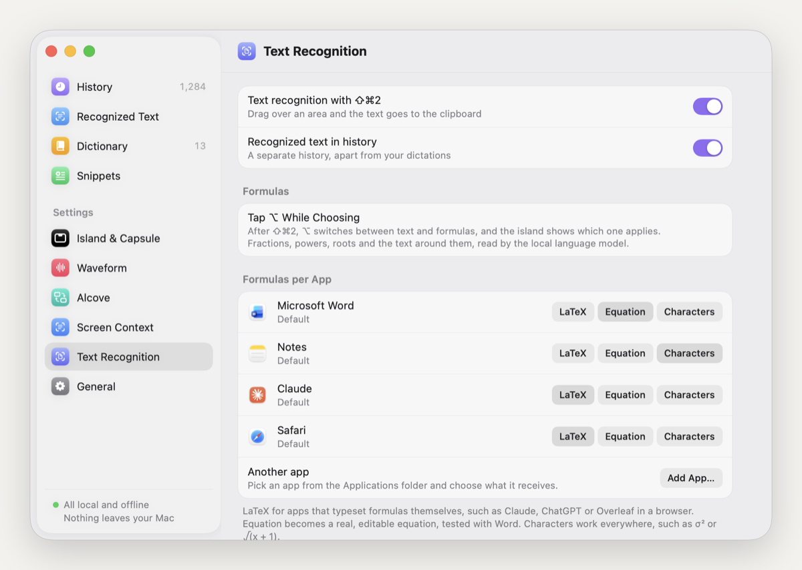

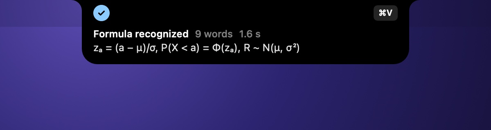

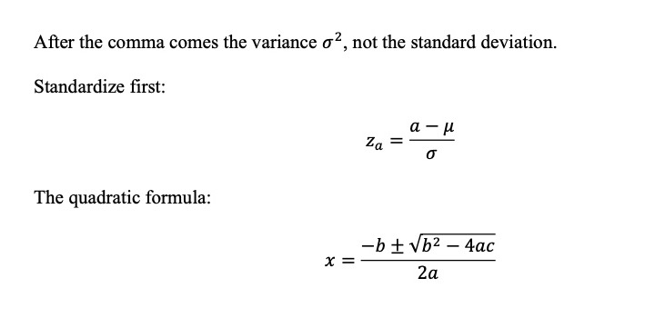

The plain `shift+cmd+2` stays exactly as fast as before; formulas take 1.5 to 3 seconds, about 4 seconds the first time after a pause while the model loads. The vision part shares the language model's weights, so it adds about 1 GB of memory only while it is in use and nothing when idle.

### Screen context

VoiceBud looks at the app and the text around your cursor to spell names right and match the tone. It never reads password fields and stores nothing. The confirmation shows what it used.

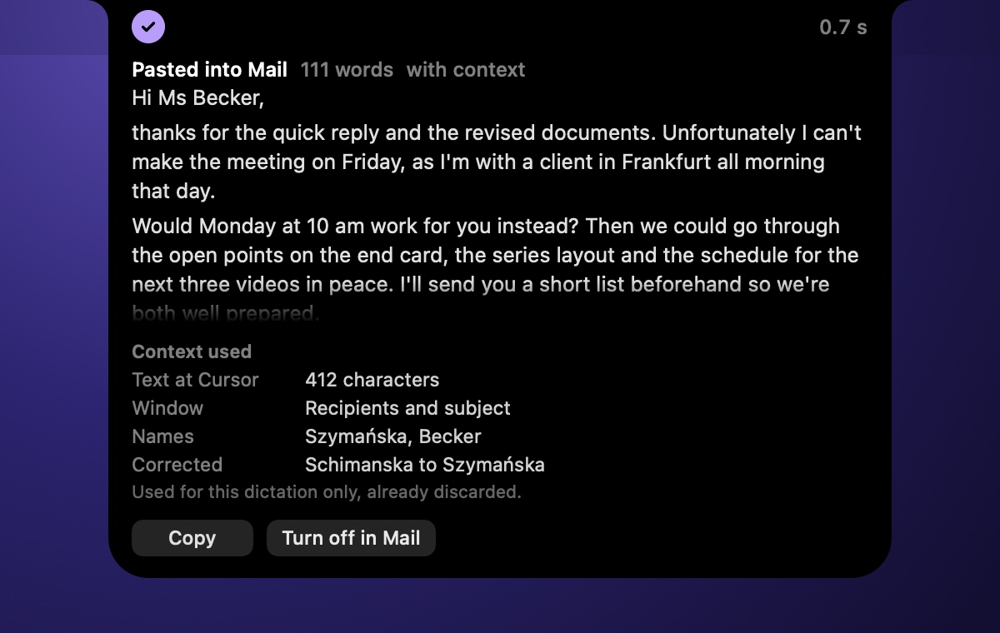

### Learns your words, plus snippets

Correct a word right after it was pasted and VoiceBud remembers the spelling for the next time. Snippets turn a spoken trigger into a whole block of text.

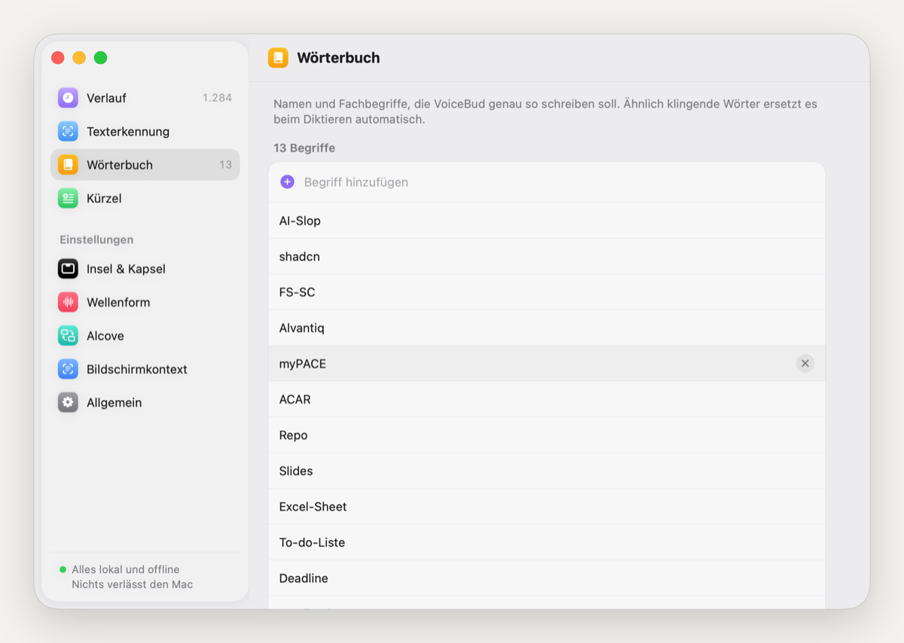

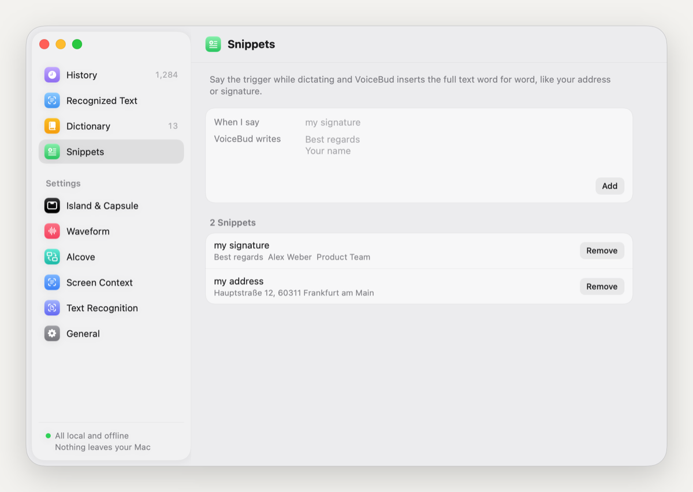

### Island or capsule, and Alcove

On Macs without a notch, or if you prefer it, VoiceBud floats as a capsule below the menu bar. With Alcove running, VoiceBud takes the notch while Alcove shows nothing and moves below it while Alcove shows something.

### When it takes longer

From 5 seconds the island counts the seconds; from 10 seconds it says so and offers to cancel with the same keys.

### The hub

History with the original transcript next to the cleaned text, recognized text, the dictionary, snippets, the look of the island, screen context per app, text recognition with formulas per app, and general settings, including both languages and the keyboard shortcuts. Open it from the microphone in the menu bar.

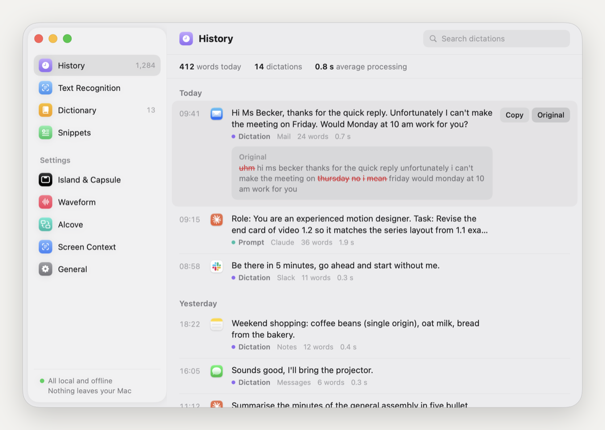

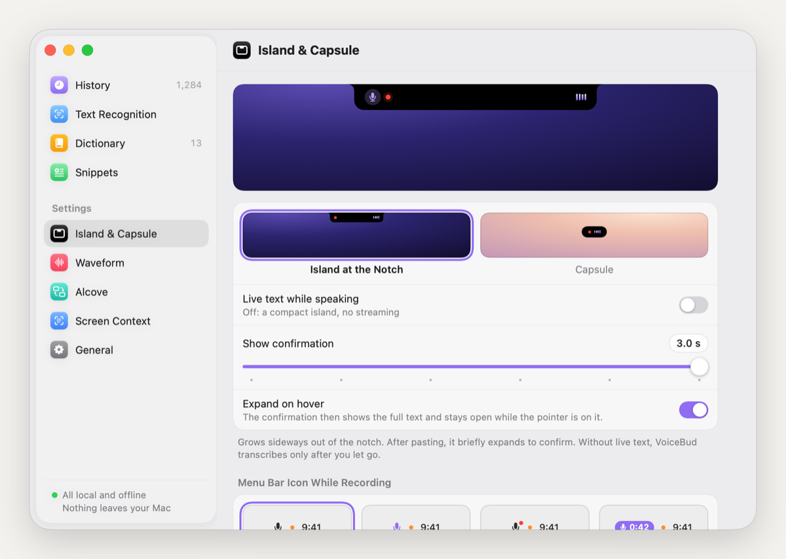

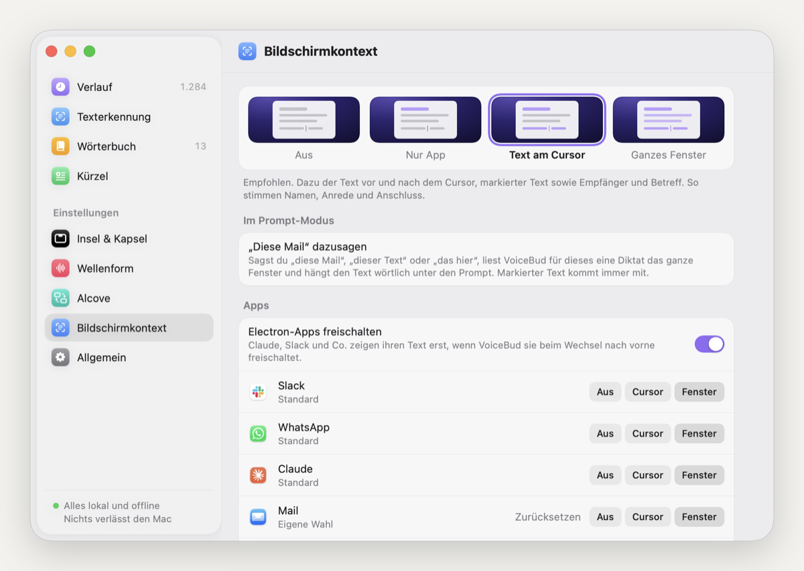

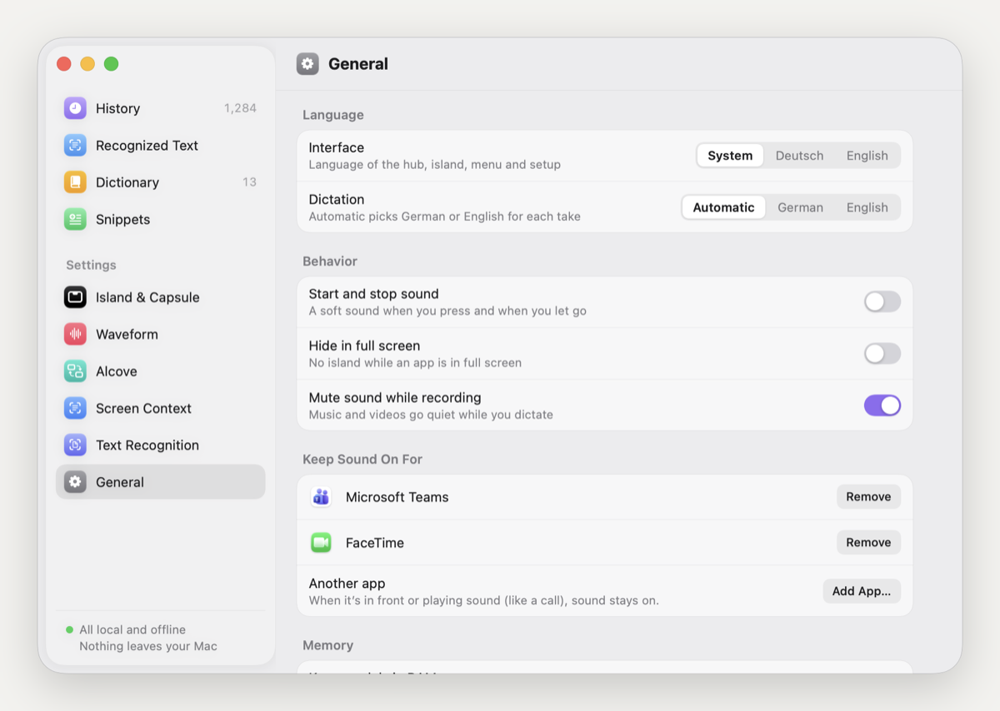

#### Your own shortcuts

The keys above are the defaults. Each of the four can be changed in the hub under General, Keyboard Shortcuts: click Change and press the new keys, and Default brings the original back. No restart needed, and while you press them nothing starts.
- **Modifier keys alone:** `ctrl`, `option`, `shift` and `cmd`, two or more of them, or one right-hand key alone (the right `cmd`, say; not for Command, which starts the moment it is pressed). Hold them together and let go.
- **Modifiers with a key:** Like `ctrl+W`, `option+shift+cmd+D` or an F-key. VoiceBud registers them with macOS, so the key never reaches the app in front, and holding works for Command too.
- **What is refused, and why:** Anything macOS uses system-wide (Spotlight, screenshots, Mission Control and whatever is switched on in System Settings), what nearly every app or the text system needs (`cmd+W`, `ctrl+A`), keys that type a character you need (`option+L` is `@` on a German layout, signs, €, quotation marks, accents), and combinations that would start another of VoiceBud's shortcuts as well (a shorter one inside a longer one is made safe instead: it only counts when pressed on its own). The row says in red what the keys do instead, offers a free variant on the same key and keeps listening for another try.
- **Notes:** A combination that only some apps use is taken with a note and an Undo, like `ctrl+W`, which deletes a word in the Terminal, or `option+Y`, which types `¥`.

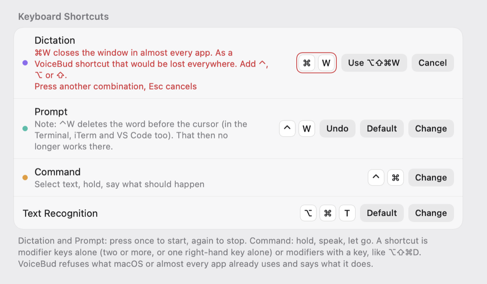

### Menu bar

Choose how the menu bar symbol shows a recording: plain (the default), in the mode's colour, with a red dot, or as a capsule with the running time.

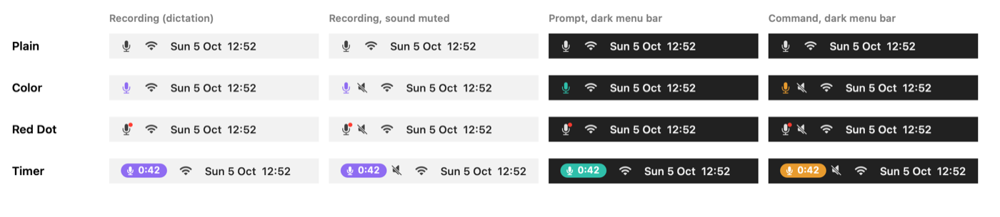
